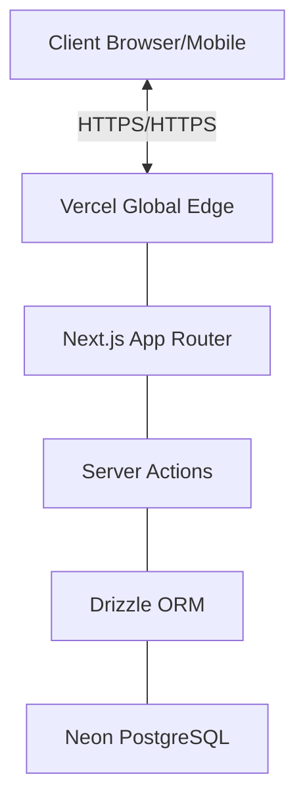
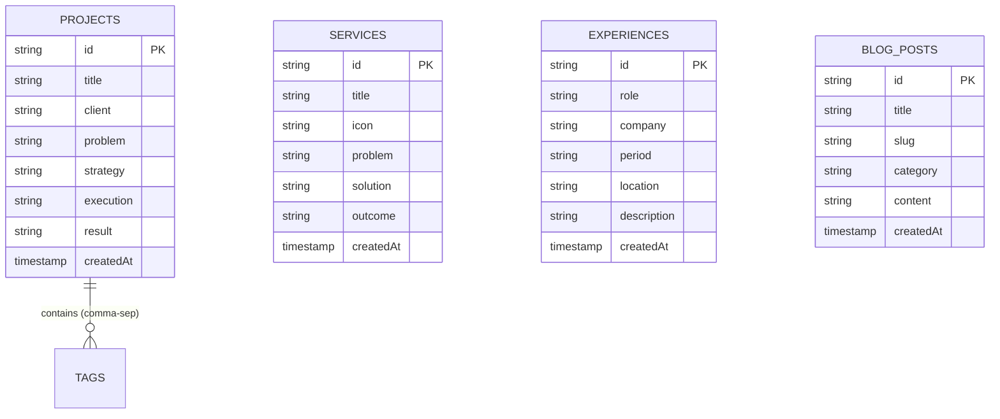
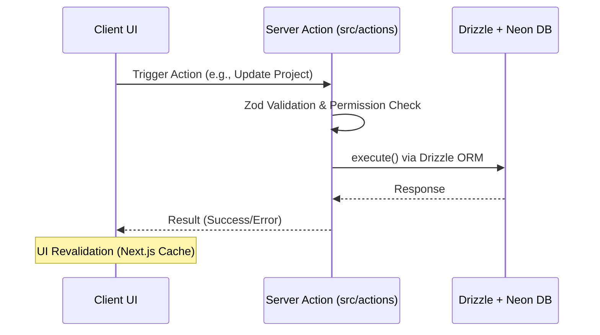

# Shibil S | Digital Marketing Strategist & SEO Expert

Professional portfolio of **Shibil S**, a results-driven Digital Marketing Executive specializing in SEO, SEM, SMM, and E-commerce growth.


## 🚀 Key Features

- **Dynamic Project Showcase**: A specialized CMS for managing and displaying marketing case studies and portfolio projects.
- **High-Performance Architecture**: Built with Next.js 16 (App Router) for lightning-fast page loads and optimal Core Web Vitals.
- **Secure Admin Panel**: A protected backend for updating content, experience, and projects in real-time.
- **SEO Optimized**: Advanced JSON-LD schema implementation, meta-tag management, and semantic HTML for maximum search visibility.
- **Responsive Design**: Premium dark-themed aesthetic using Tailwind CSS 4 and Framer Motion for smooth, high-end interactions.
- **Direct Engagement**: Integrated WhatsApp floating contact, direct call functionality, and downloadable CV.
- **Client Management**: A dedicated [Handover Guide](./HANDOVER_GUIDE.md) for non-developer site updates.

## 🛠️ Technology Stack

| Layer | Technology |
| --- | --- |
| **Framework** | Next.js 16 (App Router) |
| **Styling** | Tailwind CSS 4, Framer Motion |
| **Database** | Neon PostgreSQL (Serverless) |
| **ORM** | Drizzle ORM |
| **Validation** | Zod |
| **Icons** | Lucide React |
| **Analytics** | Google Analytics 4 |

## 📦 Project Structure

```bash
├── app/                  # Next.js App Router (Admin, Projects, Home)
├── components/           # Reusable UI components
│   ├── common/           # Shared components (e.g., WhatsApp button)
│   ├── layout/           # Global layouts (Navbar, Footer)
│   ├── sections/         # Page sections (Hero, About, Experience)
│   └── seo/              # JSON-LD and SEO components
├── lib/                  # Database config, schemas, and utilities
├── actions/              # Server Actions for CRUD operations
└── public/               # Static assets (images, PDFs)
```

## 🏗️ System Architecture

The portfolio utilizes a modern serverless stack designed for performance, security, and scalability.



## 🗄️ Database Schema

The database is architected for a content-first experience, managing everything from projects to professional services.



## 🔄 API & Data Flow

Data interactions are handled primarily through Next.js Server Actions, ensuring type safety and reduced client-side JavaScript.



## 🛠️ Getting Started

1. **Clone the repository**
   ```bash
   git clone https://github.com/ashif-ek/shibil-portfolio.git
   ```

2. **Install dependencies**
   ```bash
   npm install
   ```

3. **Environment Setup**
   Create a `.env.local` file:
   ```env
   DATABASE_URL="your-postgresql-url"
   ```

4. **Database Sync**
   ```bash
   npx drizzle-kit push
   ```

5. **Run the development server**
   ```bash
   npm run dev
   ```

## 📈 SEO Performance

This portfolio is engineered for high-intent search visibility, targeting technical and marketing-focused keywords in the Kerala region and beyond.

- **Semantic Heading Hierarchy**
- **Image Optimization (Next/Image)**
- **Meta Description & OG Tag Management**
- **Person & Breadcrumb JSON-LD Schemas**

---

## 🤝 Contact

- **Email**: sshibil14954@gmail.com
- **LinkedIn**: [linkedin.com/in/shibil-s-433000370](https://linkedin.com/in/shibil-s-433000370)
- **WhatsApp**: [+91 8590658417](https://wa.me/918590658417)

## 👨‍💻 Developed By

This portfolio was architected and developed by **Ashif E.K**.

- **Website**: [ashifek.in](https://ashifek.in)
- **Repository**: [github.com/ashif-ek/shibil-portfolio](https://github.com/ashif-ek/shibil-portfolio)
